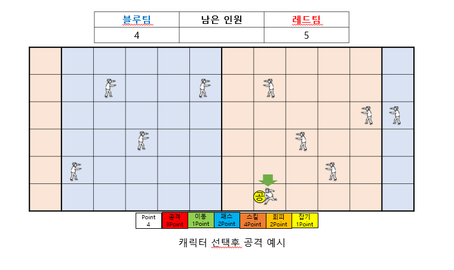
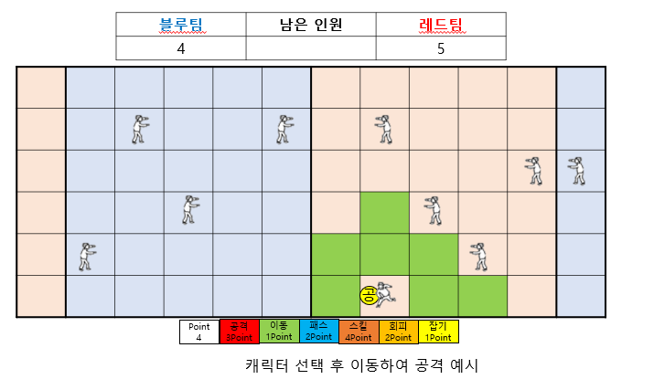
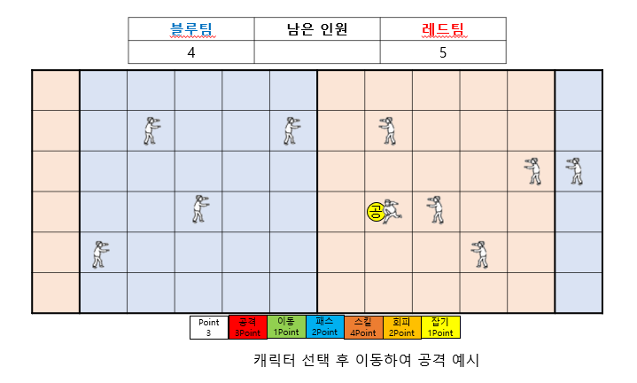
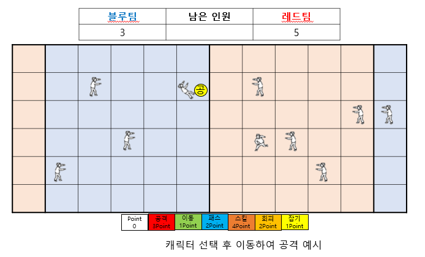
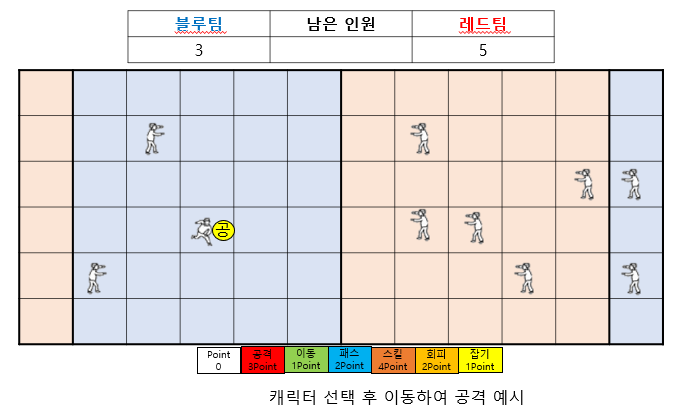

# [컨셉]
## 메인컨셉 : 경쟁
- 타인과의 1대1 대결로 승리를 하여 만족감을 얻는것이 주된 컨셉입니다.

### 서브 컨셉 1 : 가벼움, 인스턴트
- 복잡한 조작 필요없이 심플한 터치&드래그 방식으로 공을 던지고 잡을 수 있게 만들려고 합니다.
### 서브 컨셉 2 : 랜덤성, 운
- 게임의 긴장감을 높이기 위해 확률성을 추가하여 다양한 방식의 플레이나 상상치도 못한 역전의 발판을 만들어 줍니다.
### 서브 컨셉 3 : 커스터마이징
- 자신이 원하는 특성 분배를 통해 유저친화적으로 밸런스를 맞추는 컨셉입니다.
### 서브 컨셉 4 : 간단한 조작감
- 복잡한 조작 필요없이 심플한 터치&드래그 방식으로 공을 던지고 잡을 수 있게 만들려고 합니다.

  
# [관련 이미지]
- 이미지  

  
# [대표 이미지]

  
# [대표이미지 기반 작품묘사]
> ### 대표이미지 기반 :

  
# [<피구 게임> 구성 요소]

## 1. 메커니즘

[도전 과제]

상대의 수를 생각하고 그에 맞춰서 캐릭터를 조작하여 공격과 회피 그리고 스킬등을 사용하여 상대팀을 모두 퇴장시켜야합니다.

[재미 요소]
1) 스킬을 자유롭게 찍어서 상황에 맞게 유리하게 이끌어갈 수 있습니다.
2) 적의 행동을 예측하고 행동하여 큰 이득을 취할 수 있습니다.
3) 확률적인 요소를 통해 예상치못한 상황으로 역전의 발판을 만들 수 있습니다.
