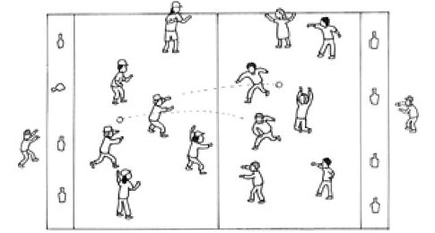
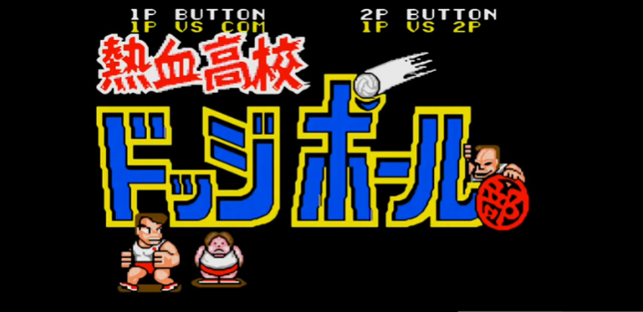
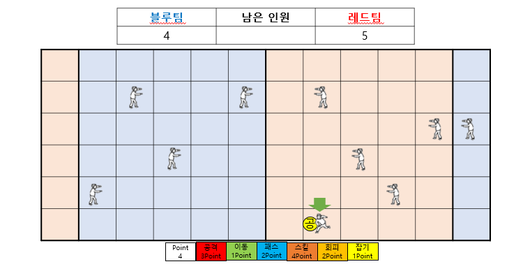

# 피구 게임 기획
# [목차]

1. [컨셉](#컨셉)
2. [관련 이미지 & 동영상](#관련-이미지-&-동영상)

# [컨셉]
## 메인컨셉 : 경쟁
- 타인과의 1대1 대결로 승리를 하여 만족감을 얻는것이 주된 컨셉입니다.

### 서브 컨셉 1 : 가벼움, 인스턴트
- 복잡한 조작 필요없이 심플한 터치&드래그 방식으로 공을 던지고 잡을 수 있게 만들려고 합니다.
### 서브 컨셉 2 : 랜덤성, 운
- 게임의 긴장감을 높이기 위해 확률성을 추가하여 다양한 방식의 플레이나 상상치도 못한 역전의 발판을 만들어 줍니다.
### 서브 컨셉 3 : 커스터마이징
- 자신이 원하는 특성 분배를 통해 유저친화적으로 밸런스를 맞추는 컨셉입니다.
### 서브 컨셉 4 : 간단한 조작감
- 복잡한 조작 필요없이 심플한 터치&드래그 방식으로 공을 던지고 잡을 수 있게 만들려고 합니다.

  
# [관련 이미지 & 동영상]
- 이미지  

- 동영상 

  
# [대표 이미지]

  
# [컨셉 & 대표이미지 기반 작품묘사]
> ### 대표이미지 기반 :

플레이어가 전 턴타이밍에 공격을 성공하여 한명을 퇴장시킨다음 잡기모드를 사용하였고 상대방의 공격을 잡아서 공격주도권을 잡았습니다. 이제 플레이어의 턴이 돌아왔고 적에게 반격을 시작하기 위해 캐릭터를 선택한 모습입니다. 
  

> ### 컨셉 기반 :

"                                   "

  
# [피구 게임 구성 요소]

## 1. 메커니즘

[도전 과제]

상대의 수를 생각하고 상황에 맞게 캐릭터를 조작하고 공격과 회피 그리고 스킬등을 사용하여 상대팀을 모두 퇴장시켜 우승하여야 합니다. 

[재미 요소]
1) 스킬을 자유롭게 찍어서 상황에 맞게 유리하게 이끌어갈 수 있습니다. 
2) 적의 행동을 예측하고 행동하여 큰 이득을 취할 수 있습니다. 
3) 확률적인 요소를 통해 예상치못한 상황으로 역전의 발판을 만들 수 있습니다.

## 2. 이야기
[만들게 된 배경]

[카메라 관점]

# 게임시스템 디자인
## 1. 게임 오브젝트 분해

|연번|오브젝트 이름|오브젝트 이미지|
|:---:|:---:|:---:|
|1|플레이어|???|
|2|피구공|???|
|3|???|???|
|4|???|???|
|5|???|<???|
|6|맵ㅡ 맵|???|

## 2. 프라미터

> [플레이어]

|속성|속성값|설명|비고|
|:---:|:---:|:---:|:---:|
|이동거리|상하좌우로 1칸씩 2번이동|???|???|
|행동력|4포인트|???|???|
|패스|성공률 : 60%  행동력 : |???|???|
|???|???|???|???|

> [공]

|속성|속성값|설명|비고|
|:---:|:---:|:---:|:---:|
|이동속도|2m/s|???|???|
|???|???|???|???|
|???|???|???|???|
|???|???|???|???|

> [스킬]

|속성|속성값|설명|비고|
|:---:|:---:|:---:|:---:|
|공격|공격 사거리2칸 증가, 공격성공확률 20퍼 증가|???|???|
|회피|회피확률 10퍼 증가|???|???|
|캐치|잡을확률 10퍼증가, 잡는범위1칸 증가|???|???|
|지원|랜덤으로 적의 회피확률 15퍼감소, 랜덤으로 아군의 공격성공확률 15퍼증가|???|???|

> [특성]

|속성|속성값|설명|비고|
|:---:|:---:|:---:|:---:|
|제공포인트|5포인트|???|???|
|공격|2포인트당 사거리 1칸증가, 1포인트당 공격성공확률 3퍼증가|???|???|
|이동|3포인트당 이동횟수 1증가|???|???|
|회피|1포인트당 회피확률 3퍼증가|???|???|
|캐치|1포인트당 잡을확률 2퍼증가|???|???|
|지원|1포인트당 패스확률 5퍼증가|???|???|
|행동력|2포인트당 행동력 1증가|???|???|

# [요구사항]

시작화면, 게임세팅, 게임화면, 설정화면 총 4개의 화면이 있다.
시작화면에는 게임시작, 게임세팅, 환경설정, 게임종료라는 버튼 4개가 있다.

게임시작 클릭 시 게임화면으로 이동한다.
게임세팅 클릭 시 게임세팅으로 이동한다.
환경설정 클릭 시 설정화면으로 이동한다.

게임세팅 화면에서는 저장하기와 돌아가기 버튼이 있고 기존에 설정한 스킬세팅들과 변경가능한 스킬들을 보여준다
게임설정 화면에서는 돌아가기 버튼, 사운드조절, 닉네임표시체크칸 등이 있고 돌아가기버튼 클릭 시 시작화면으로 이동한다.
시작화면에서 게임시작 버튼을 누르면 게임화면으로 변경된다.
게임화면에는 각 팀의 남은인원수가 상단의 표시된다. 중간에는 게임화면이 나오고 가로는12칸(레드팀1줄/블루팀5줄/중앙/레드팀5줄/블루팀1줄), 세로는6칸의 직사각형이다.

하단에는 남은 포인트를 보여주는칸과 공격, 이동, 스킬 등의 캐릭터조작버튼이 존재한다. 
조작은 마우스로 캐릭터를 클릭하여 하단에 있는 캐릭터 조작버튼으로 한다.
공격을 받을시 확률에 따라 회피, 잡기, 퇴장을 당하며 퇴장을 당할시 적팀의 뒷쪽으로 이동된다
한쪽 팀의 남은 인원이 0명이 되면 게임이 끝나며 승리팀을 보여주고 돌아가기 버튼을 클릭시 시작화면으로 돌아간다
