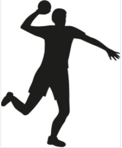

# 피구 게임 기획
# [목차]

1. [컨셉](#컨셉)
2. [관련 이미지 & 동영상](#관련-이미지-&-동영상)
3. [대표이미지](#대표이미지)
4. [컨셉 & 대표이미지 기반 작품묘사](#컨셉-&-대표이미지-기반-작품묘사)
5. [피구 게임 구성 요소](#피구-게임-구성-요소)
6. [게임시스템 디자인](#게임시스템-디자인)  
    a. [게임 오브젝트 분해](#-게임-오브젝트-분해)  
    b. [파라미터](#2.-파라미터)  
    c. [행동](#3.-행동)  
    d. [상태](#3.-상태)  
    e. [플레이어 캐릭터 속성](#5.-플레이어-캐릭터-속성)  
    f. [게임의 규칙](#6.-게임의-규칙)  
    g. [7. 게임에서 사용될 공식](#7.-게임에서-사용될-공식)  
7. [요구사항](#요구사항)

# [컨셉]
## 메인컨셉 : 경쟁
- 타인과의 1대1 대결로 승리를 하여 만족감을 얻는것이 주된 컨셉입니다.

### 서브 컨셉 1 : 가벼움, 인스턴트
- 복잡한 조작 필요없이 심플한 터치&드래그 방식으로 공을 던지고 잡을 수 있게 만들려고 합니다.
### 서브 컨셉 2 : 랜덤성, 운
- 게임의 긴장감을 높이기 위해 확률성을 추가하여 다양한 방식의 플레이나 상상치도 못한 역전의 발판을 만들어 줍니다.
### 서브 컨셉 3 : 커스터마이징
- 자신이 원하는 특성 분배를 통해 유저친화적으로 밸런스를 맞추는 컨셉입니다.
### 서브 컨셉 4 : 간단한 조작감
- 복잡한 조작 필요없이 심플한 터치&드래그 방식으로 공을 던지고 잡을 수 있게 만들려고 합니다.

  
# [관련 이미지 & 동영상]
- 이미지  

- 동영상 

  
# [대표 이미지]

  
# [컨셉 & 대표이미지 기반 작품묘사]
> ### 대표이미지 기반 :

플레이어가 전 턴타이밍에 공격을 성공하여 한명을 퇴장시킨다음 잡기모드를 사용하였고 상대방의 공격을 잡아서 공격주도권을 잡았습니다. 이제 플레이어의 턴이 돌아왔고 적에게 반격을 시작하기 위해 캐릭터를 선택한 모습입니다. 
  

> ### 컨셉 기반 :

"                                   "

  
# [피구 게임 구성 요소]

## 1. 메커니즘

[도전 과제]

상대의 수를 생각하고 상황에 맞게 캐릭터를 조작하고 공격과 회피 그리고 스킬등을 사용하여 상대팀을 모두 퇴장시켜 우승하여야 합니다. 

[재미 요소]
1) 스킬을 자유롭게 찍어서 상황에 맞게 유리하게 이끌어갈 수 있습니다. 
2) 적의 행동을 예측하고 행동하여 큰 이득을 취할 수 있습니다. 
3) 확률적인 요소를 통해 예상치못한 상황으로 역전의 발판을 만들 수 있습니다.

## 2. 이야기
[만들게 된 배경]

[카메라 관점]

# [게임시스템 디자인]
## 1. 게임 오브젝트 분해

|연번|오브젝트 이름|오브젝트 이미지|
|:---:|:---:|:---:|
|1|플레이어||
|2|피구공||
|3|맵||

## 2. 파라미터

> [플레이어]

|속성|속성값|설명|비고|
|:---:|:---:|:---:|:---:|
|행동력|6point|행동 포인트||
|공격|성공률 : 75%  행동력 : 3|공격 성공시 적 플레이어에게 공격권이 넘어감|행동력 3이되면 나머지행동 비활성화|
|회피|성공률 : (1-공격성공률)/2 %|회피 성공시 상하좌우랜덤으로 1칸이동 이동할 공간이 없을시 공에 맞게됨||
|캐치|성공률 : (1-공격성공률)/2 %|성공시 해당 오브젝트가 공을 잡음 ||
|패스|성공률 : 80%  행동력 : 2|아군 플레이어를 선택하여 공을 패스함 실패시 적에게 공격권이 넘어감|행동력이 4이하때 사용불가|
|이동|행동력 : 1|상하좌우로 1칸 이동|행동력이 3이하때 사용불가|
|잡기모드|행동력 : 2|???|행동력이 4이하때 사용불가|
|회피모드|행동력 : 1||행동력이 3이하때 사용불가|
|스킬|행동력 : 3|스킬 사용가능(스킬칸에서 확인가능)|행동력 5이하때 사용불가|

> [공]

|속성|속성값|설명|비고|
|:---:|:---:|:---:|:---:|
|이동속도|2m/s|1칸당 1m로 잡는다||
|이동방향||중앙선 기준으로 왼쪽 플레이어들이 던질시 오른쪽으로 이동  중앙선 기준으로 오른쪽 플레이어들이 던질시 왼쪽으로 이동||

> [스킬]

|속성|속성값|설명|비고|
|:---:|:---:|:---:|:---:|
|공격|1. 공격 사거리2칸 증가 2. 공격성공확률 20퍼 증가|공격 관련된 스킬|1번or2번 선택가능|
|회피|1. 회피확률 10퍼 증가|회피 관련된 스킬||
|캐치|1. 잡을확률 10퍼증가 2. 잡는범위1칸 증가|캐치 관련된 스킬|1번or2번 선택가능|
|지원|1. 랜덤으로 적의 회피확률 15퍼감소 2. 랜덤으로 아군의 공격성공확률 15퍼증가|지원 관련된 스킬|1번or2번 선택가능|

> [특성]

|속성|속성값|설명|비고|
|:---:|:---:|:---:|:---:|
|제공포인트|5point|특성을 찍을수 있는 포인트||
|공격|2point -> 사거리 +1 1point당 공격성공확률 3퍼증가|공격과 관련된 특성||
|이동|3point -> 이동횟수 +1|이동횟수가 증가하는 특성||
|회피|1point -> 회피확률 +3%|회피확률이 증가하는 특성||
|캐치|1point -> 잡을확률 +3%|캐치확률이 증가하는 특성||
|지원|1point -> 패스확률 +5%|패스확률이 증가하는 특성||
|행동력|2point -> 행동력 +1|행동력이 증가하는 특성||

## 3. 행동
> [플레이어]

|행동|설명|
|:---:|:---:|
|공격, 패스|지정한 위치로 공을 던짐|
|대기|클릭하지 않았을 경우 대기함|
|이동|지정한 위치로 이동함|
|회피|공과 부딪혔을때 회피성공시 랜덤으로 한칸 이동|
|잡기|공과 부딪혔을때 캐치성공시 공을 잡음|

## 4. 상태
> [플레이어]

|현상태|전이상태|전이조건|
|:---:|:---:|:---:|
|대기상태|회피상태|회피 성공한 경우|
|대기상태|캐치상태|캐치 성공한 경우|
|대기상태|공격상태|공격하려는곳을 지정한 경우|
|대기상태|사망상태|공에 맞은경우|
||???|???|

## 5. 플레이어 캐릭터 속성
|속성|영문명칭|설명|비고|
|:---:|:---:|:---:|:---:|
|행동력|Action|캐릭터의 행동량||
|공격|Attack|||
|회피|evasion|||
|캐치|Catch|||
|패스|pass|||
|이동|move|||
|스킬|skill|||

## 6. 게임의 규칙
### 1. 핵심 규칙
- 
- 
### 2. 보조 규칙
- 
- 

## 7. 게임에서 사용될 공식
### 1. 캐릭터를 선택시 하단에 UI가 뜬다.
### 2. ???
### 3. ???
### 4. ???

# [요구사항]

시작화면, 게임세팅, 게임화면, 설정화면 총 4개의 화면이 있다.
시작화면에는 게임시작, 게임세팅, 환경설정, 게임종료라는 버튼 4개가 있다.

게임시작 클릭 시 게임화면으로 이동한다.
게임세팅 클릭 시 게임세팅으로 이동한다.
환경설정 클릭 시 설정화면으로 이동한다.

게임세팅 화면에서는 저장하기와 돌아가기 버튼이 있고 기존에 설정한 스킬세팅들과 변경가능한 스킬들을 보여준다
게임설정 화면에서는 돌아가기 버튼, 사운드조절, 닉네임표시체크칸 등이 있고 돌아가기버튼 클릭 시 시작화면으로 이동한다.
시작화면에서 게임시작 버튼을 누르면 게임화면으로 변경된다.
게임화면에는 각 팀의 남은인원수가 상단의 표시된다. 중간에는 게임화면이 나오고 가로는12칸(레드팀1줄/블루팀5줄/중앙/레드팀5줄/블루팀1줄), 세로는6칸의 직사각형이다.

하단에는 남은 포인트를 보여주는칸과 공격, 이동, 스킬 등의 캐릭터조작버튼이 존재한다. 
조작은 마우스로 캐릭터를 클릭하여 하단에 있는 캐릭터 조작버튼으로 한다.
공격을 받을시 확률에 따라 회피, 잡기, 퇴장을 당하며 퇴장을 당할시 적팀의 뒷쪽으로 이동된다
한쪽 팀의 남은 인원이 0명이 되면 게임이 끝나며 승리팀을 보여주고 돌아가기 버튼을 클릭시 시작화면으로 돌아간다
